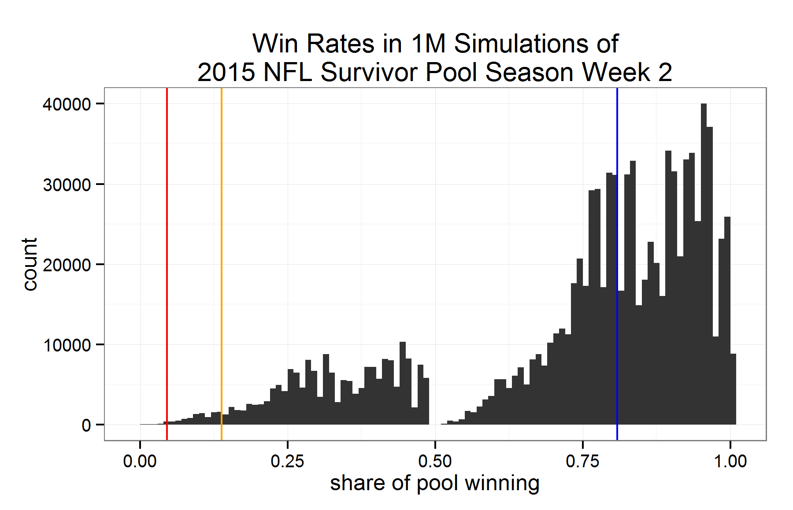

# NFL Survivor Pool Win Total Simulations

### Simulations to answer: what is the likelihood of a given % of entrants making it through a week, given the pick distribution and win probabilities?

See the full context & writeup at my blog: http://samfirke.com/2015/09/28/calculating-likelihood-of-x-of-entrants-advancing-in-an-nfl-survivor-pool/

The code lives here in the file `2015 survivor week 2 analysis.R`.  It takes the pick distributions and win probability for a given NFL football week and then runs 1 million simulations of that week, generating a distribution of the % of survivor pool entrants who win.

The particular inputs used in this file are from the 2015 NFL Season Week 2, which (my analysis shows) produced a staggering share of losses, a 1-in-1461 event.  But you can swap in new values and re-run for any particular week. 

## Results

Here are a million simulations of week 2 of the 2015 NFL season. The blue line is the median expected result, the yellow line is the 1st percentile expected result, and the red line is the actual result.

